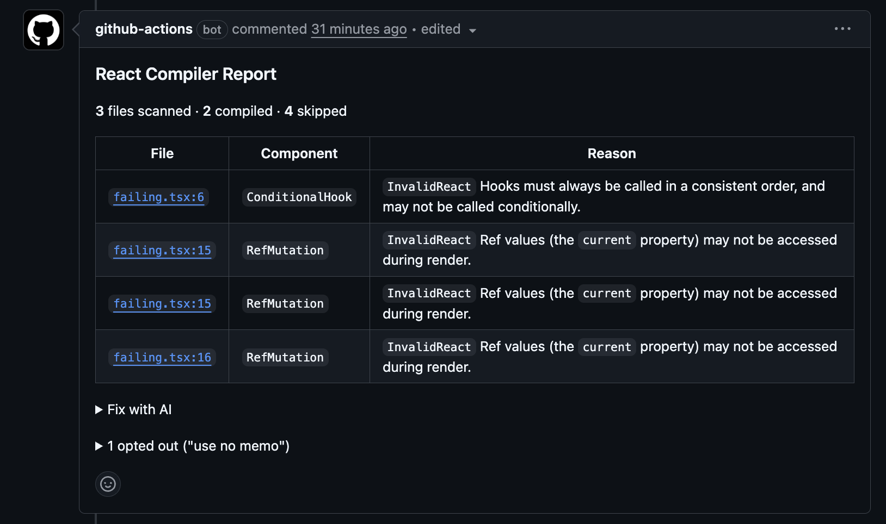

<div align="center">
  <h1>react-compiler-action</h1>
  <p>Catch React Compiler issues before they reach production.</p>
</div>

<p align="center">
  <a href="https://github.com/shubh73/react-compiler-action/releases"></a>
  <a href="https://github.com/shubh73/react-compiler-action/actions/workflows/ci.yml"></a>
  <a href="LICENSE"></a>
</p>

<p align="center">
  <a href="#why"><b>Why</b></a>
  &nbsp;&nbsp;&middot;&nbsp;&nbsp;
  <a href="#usage"><b>Usage</b></a>
  &nbsp;&nbsp;&middot;&nbsp;&nbsp;
  <a href="#inputs"><b>Inputs</b></a>
  &nbsp;&nbsp;&middot;&nbsp;&nbsp;
  <a href="#outputs"><b>Outputs</b></a>
  &nbsp;&nbsp;&middot;&nbsp;&nbsp;
  <a href="#examples"><b>Examples</b></a>
  &nbsp;&nbsp;&middot;&nbsp;&nbsp;
  <a href="#how-it-works"><b>How it works</b></a>
</p>

<p align="center">
  
</p>

## Why

React Compiler flags code it can’t safely optimize. Most CI checks report every violation at once, which buries new regressions in old debt and makes adoption harder.

This action fits the review workflow instead. It compares against the base branch and reports only what the PR introduced. Reviewers can scan it, authors can act on it and agents can fix it.

## Usage

```yaml
name: React Compiler
on:
  pull_request:
    branches: [main]

jobs:
  compiler-check:
    runs-on: ubuntu-latest
    permissions:
      contents: read
      pull-requests: write
    steps:
      - uses: actions/checkout@v4
        with:
          fetch-depth: 0

      - uses: shubh73/react-compiler-action@v1
```

No dependencies to install. The action bundles `babel-plugin-react-compiler` and warns you if the bundled version differs from the one in your project. You get:

- **PR comment** with a table of compiler issues, severity tags and clickable source links
- **Inline annotations** on compiler-provided issue lines when available
- **New vs existing** separation so you're not blocked by other people's code
- **Directive visibility** for functions opted into or out of compilation
- **Structured outputs** for downstream workflow steps
- **Fix with AI** prompt for your agent

## Inputs

| Name | Default | Description |
|------|---------|-------------|
| `token` | `${{ github.token }}` | GitHub token for PR comments and API access |
| `changed-files-only` | `true` | Only check files changed in the PR. Set to `false` for a full project scan |
| `fail-on-error` | `false` | Fail the step when new compiler issues are found. Existing issues on the base branch are not counted |
| `post-comment` | `true` | Post or update a PR comment with the compiler report |
| `annotations` | `true` | Emit inline annotations on the PR diff (new issues only) |
| `annotation-level` | `warning` | Severity level for annotations: `warning`, `error`, or `notice` |
| `compilation-mode` | `infer` | React Compiler mode: `infer`, `annotation`, or `all` |
| `working-directory` | `.` | Root directory for file discovery |
| `include-patterns` | `**/*.{ts,tsx,js,jsx}` | Newline-separated glob patterns for files to include |
| `exclude-patterns` | Sensible defaults | Newline-separated glob patterns to exclude |

## Outputs

All outputs are set on every run, regardless of which features are enabled.

| Name | Description |
|------|-------------|
| `failure-count` | Total number of compiler issues |
| `new-failure-count` | Compiler issues newly introduced in this PR (not on base branch) |
| `existing-failure-count` | Compiler issues already present on the base branch |
| `file-count` | Number of files scanned |
| `has-failures` | `true` or `false` |
| `report` | Full Markdown report, available even if `post-comment` is disabled |
| `comment-id` | GitHub comment ID if a comment was posted |

## Examples

### Block PRs that introduce new issues

```yaml
- uses: shubh73/react-compiler-action@v1
  with:
    fail-on-error: true
    annotation-level: error
```

### Full project scan

```yaml
- uses: shubh73/react-compiler-action@v1
  with:
    changed-files-only: false
```

### Annotations only, no PR comment

```yaml
- uses: shubh73/react-compiler-action@v1
  with:
    post-comment: false
```

### Use outputs in a downstream step

```yaml
- uses: shubh73/react-compiler-action@v1
  id: compiler
  with:
    post-comment: false
    annotations: false

- if: steps.compiler.outputs.has-failures == 'true'
  run: echo "New issues: ${{ steps.compiler.outputs.new-failure-count }}"
```

### Incremental adoption with `"use memo"`

```yaml
- uses: shubh73/react-compiler-action@v1
  with:
    compilation-mode: annotation
```

## How it works

1. Finds files changed in the PR (or all files in full-scan mode)
2. Runs each through `babel-plugin-react-compiler` in check-only mode
3. Classifies compiler issues by severity
4. Compares against the base branch to label new vs. existing issues
5. Detects functions opted into or out of compilation via AST analysis
6. Posts an idempotent PR comment with issue tables, source links and a fix-with-AI prompt
7. Emits inline annotations for new issues only
8. Sets structured outputs for downstream steps

## Contributing

See [CONTRIBUTING.md](CONTRIBUTING.md).

## License

[MIT](LICENSE)
